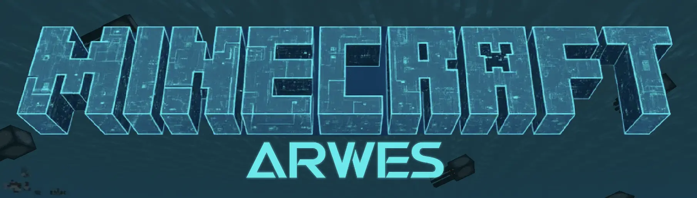
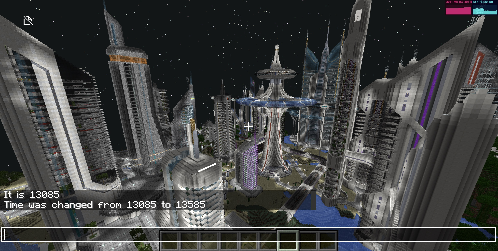
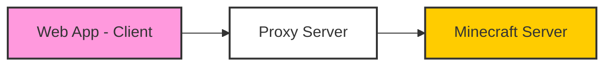
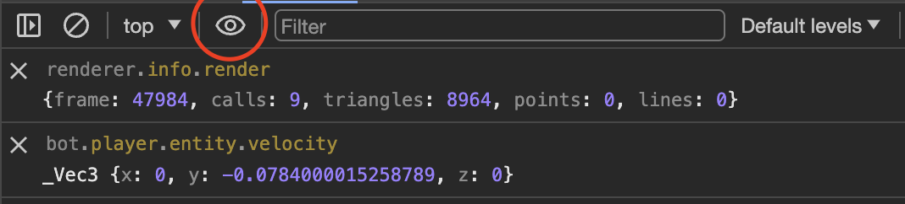

# Minecraft Web Client

Custom self-hosted build for Zonely replay viewing.

Based on `zardoy/minecraft-web-client`, with local replay-related patches for player movement rendering.


Minecraft **clone** written in TypeScript using the best modern web technologies. A vanilla-compatible client and integrated server packaged into a single web app.

You can try this out at [mcraft.fun](https://mcraft.fun/), [mcon.vercel.app](https://mcon.vercel.app/), or the GitHub Pages deployment. Every commit from the default (`next`) branch is deployed to [s.mcraft.fun](https://s.mcraft.fun/) and [beta.mcraft.fun](https://beta.mcraft.fun/) - it's usually newer, but might be less stable.

> SAFEST way to join servers.
>
> FASTEST way to preview local worlds.

Don't confuse this with [Eaglercraft](https://eagsrc.webmc.xyz) which is a REAL vanilla Minecraft Java Edition port to the web (but with its own limitations). Eaglercraft is a fully playable solution, meanwhile this project is aimed at *device-compatibility* and better performance so it feels portable, flexible and lightweight. It's also a good example on how to build true HTML games for the web at scale entirely with the JS ecosystem. Have fun!

> **UI Design Philosophy**: For now, this project follows classic Minecraft UI guidelines. But if you want to see my **unleashed vision** of the most beautiful UI with stunning animations and futuristic design - check out **[arwes.mcraft.fun](https://arwes.mcraft.fun)**!
>
> [](https://arwes.mcraft.fun)

For building the project yourself / contributing, see [Development, Debugging & Contributing](#development-debugging--contributing). For reference at what and how web technologies / frameworks are used, see [TECH.md](./TECH.md) (also for comparison with Eaglercraft).

> **Note**: See [Self-hosting & proxy](#servers--proxy) for Docker, proxy-only setups, and a one-liner VPS script with [Minecraft Everywhere](https://github.com/zardoy/minecraft-everywhere).

### Big Features

- Official Mineflayer [plugin integration](https://github.com/zardoy/mcraft-fun-mineflayer-plugin)! View / Control your bot remotely.
- Open any zip world file or even folder in read-write mode!
- Connect to Java servers running in both offline (cracked) and online mode* (it's possible because of proxy servers, see below)
- Integrated JS server clone capable of opening Java world saves in any way (folders, zip, web chunks streaming, etc)
- Singleplayer mode with simple world generations!
- Works offline
- First-class touch (mobile) & controller support
- First-class keybindings configuration
- Advanced Resource pack support: Custom GUI, all textures. Server resource packs are supported with proper CORS configuration.
- Built-in JEI with recipes & descriptions for almost every item (JEI is a creative-inventory replacement)
- Custom protocol channel extensions (eg for custom block models in the world)
- Play with friends over internet! (P2P is powered by Peer.js discovery servers)
- ~~Google Drive support for reading / saving worlds back to the cloud~~
- Support for custom rendering 3D engines. Modular architecture.
- and more!

All components that are in [Storybook](https://minimap.mcraft.fun/storybook/) are published as npm module and can be used in other projects: [`minecraft-react`](https://npmjs.com/minecraft-react)

### Recommended Settings

- Controls -> **Touch Controls Type** -> **Joystick**
- Controls -> **Auto Full Screen** -> **On** - To avoid ctrl+w issue
- Interface -> **Enable Minimap** -> **Always** - To enable useful minimap (why not?)
- Controls -> **Raw Input** -> **On** - This will make the controls more precise (UPD: already enabled by default)
- Interface -> **Chat Select** -> **On** - To select chat messages (UPD: already enabled by default)

### Browser Notes

This project is tested with BrowserStack. Special thanks to [BrowserStack](https://www.browserstack.com/) for providing testing infrastructure!

However, it's known that these browsers have issues:

**Opera Mini**: Disable *mouse gestures* in browser settings to avoid opening a new tab on right-click-and-hold.

**Vivaldi**: Disable Controls -> *Raw Input* in game settings if experiencing issues

### Versions Support

Server versions 1.8 - 1.21.5 are supported.
First class versions (most of the features are tested on these versions):

- 1.19.4
- 1.21.4

Versions below 1.13 are not tested currently and may not work correctly.

### World Loading

Zip files and folders are supported. Just drag and drop them into the browser window. You can open folders in read-only or read-write mode. New chunks may be generated incorrectly for now.
When opening zip files, they are stored entirely in your RAM. There is a ~300 MB file limit on iOS.
Whatever offline mode you used (zip, folder, just singleplayer), you can always export world with the `/export` command typed in the game chat.



### Servers & Proxy

You can play on almost any Java server; vanilla servers are fully supported. See the [Mineflayer](https://github.com/PrismarineJS/mineflayer) repo for supported protocol versions.

**How it works:** browsers speak WebSockets; Minecraft Java uses TCP. A **proxy** bridges the two. When you connect with a proxy URL enabled, your browser talks to the proxy over WebSocket **using the proxy's IP**; the proxy opens a TCP connection to the Minecraft server and forwards bytes without deserializing packets. All protocol handling still runs in the browser (Mineflayer in the client).



So if the server is located in Europe and you are connecting from Europe, you will have ~40ms ping (~180ms with residential proxy version), however if you are in the US and connecting to the server located in US, you will have >200ms ping, which is the worst case scenario.

Again, the proxy server is not a part of the client, it is a separate service that you can host yourself.

#### Self-hosting

| What you want | What to run |
|---------------|-------------|
| **Full stack** (your own full game copy + bundled proxy) | This repo: local dev with `pnpm i` and `pnpm prod-start` (see [CONTRIBUTING.md](./CONTRIBUTING.md)), or **Docker** with the [main Dockerfile](./Dockerfile) below. |
| **Proxy only** (keep using a public game client e.g. [mcraft.fun](https://mcraft.fun)) | Run **[mwc-proxy](https://github.com/zardoy/mwc-proxy)** somewhere that can reach your Minecraft server (often same host/VPC); follow that README for the rest. **Where to host:** your own PC or home network often behaves better than a cloud relay—some servers flag datacenter IPs like “VPN” traffic; for casual play, any reachable host is fine. **URL in the client:** paste your relay’s URL into the **proxy** field; you still have to make it reachable (reverse proxy **with SSL**, **[Cloudflare Tunnel](https://developers.cloudflare.com/cloudflare-one/connections/connect-networks/)**, temporary URL services like cloudflared are not recommended). **Note:** the Minecraft server sees **your relay’s public IP** on the TCP leg (the proxy → server connection). You do **not** need this web-client repo for proxy-only. |
| **One-liner deploy on a VPS** | [Minecraft Everywhere](https://github.com/zardoy/minecraft-everywhere) provides a **one-liner** script that can deploy these variants (your own full game copy, proxy, or combined setups)—pick what you need from that repo’s instructions. |

Public deployments (e.g. GitHub Pages) ship without your private TCP endpoint; for your own server you still point the client at **your** proxy (e.g. mwc-proxy or a stack you deployed with the script above).

**Koyeb (full app from this repo):**

[](https://app.koyeb.com/deploy?name=minecraft-web-client&type=git&repository=zardoy%2Fminecraft-web-client&branch=next&builder=dockerfile&env%5B%5D=&ports=8080%3Bhttp%3B%2F)

> **mwc-proxy vs this repo’s proxy:** [mwc-proxy](https://github.com/zardoy/mwc-proxy) is the lightweight standalone WebSocket→TCP bridge you run next to your world. This repo can embed a compatible proxy in `prod-start` / Docker. For “I only need a relay for the hosted client,” use mwc-proxy.

### Docker (self-hosted)

Use Docker when you want a reproducible install without local Node/pnpm setup (see [CONTRIBUTING.md](./CONTRIBUTING.md) only if you build from source).

**[Dockerfile](./Dockerfile)** — production image: **your own full game copy (web client) + proxy** in one process. Good when you host the full stack yourself.

For **proxy only**, use **[mwc-proxy](https://github.com/zardoy/mwc-proxy)** (including its Docker options) instead of maintaining a second image in this repo.

### Rendering

#### Three.js Renderer

- Uses WebGL2. Chunks are rendered using Geometry Buffers prepared by 4 mesher workers.
- Entities & text rendering
- Supports resource packs
- Doesn't support occlusion culling

### Advanced Settings

There are many many settings, that are not exposed in the UI yet. You can find or change them by opening the browser console and typing `options`. You can also change them by typing `options.<setting_name> = <value>`.

### Console

To open the console, press `F12`. On mobile, you can type `#dev` in the browser address bar; the page won't reload, and you'll see a button to open the console. This lets you change advanced settings, see logs, and access global variables (described below).

### Development, Debugging & Contributing

It should be easy to build/start the project locally. See [CONTRIBUTING.MD](./CONTRIBUTING.md) for more info. Also you can look at Dockerfile for reference.

There is world renderer playground ([link](https://mcon.vercel.app/playground/)).

However, there are many things that can be done in online production version (like debugging actual source code). Also you can access some global variables in the console and there are a few useful examples:

- If you type `debugToggle` and press Enter in the console — it will enable all debug messages! Warning: this will start packet spam.
Instead, I recommend setting `options.debugLogNotFrequentPackets`. You can also use `debugTopPackets` (with `JSON.stringify`) to see what packets were received/sent by name

- `bot` - Mineflayer bot instance. See Mineflayer documentation for more.
- `world` - Three.js world instance, basically does all the rendering (part of renderer backend).
- `world.sectionObjects` - Object with all active chunk sections (geometries) in the world. Each chunk section is a Three.js mesh or group.
- `debugSceneChunks` - The same as above, but relative to current bot position (e.g. 0,0 is the current chunk).
- `debugChangedOptions` - See what options are changed. Don't change options here.
- `localServer`/`server` - Only for singleplayer mode/host. Flying Squid server instance, see it's documentation for more.
- `localServer.overworld.storageProvider.regions` - See ALL LOADED region files with all raw data.
- `localServer.levelData.LevelName = 'test'; localServer.writeLevelDat()` - Change name of the world

- `nbt.simplify(someNbt)` - Simplifies nbt data, so it's easier to read.

The most useful thing in devtools is the watch expression. You can add any expression there and it will be re-evaluated in real time. For example, you can add `world.getCameraPosition()` to see the camera position and so on.



You can also drag and drop any .dat or .mca (region files) into the browser window to see it's contents in the console.

### F3 Keybindings

- `F3` - Toggle debug overlay
- `F3 + A` - Reload all chunks (these that are loaded from the server)
<!-- - `F3 + N` - Restart local server (basically resets the world!) -->
- `F3 + G` - Toggle chunk sections (geometries) border visibility + entities outline (aka Three.js geometry helpers)

world chunks have a *yellow* border, hostile mobs have a *red* outline, passive mobs have a *green* outline, players have a *blue* outline.

### Query Parameters

Press `Y` to set query parameters to url of your current game state.

There are some parameters you can set in the url to archive some specific behaviors:

General:

- **`?setting=<setting_name>:<setting_value>`** - Set and lock the setting on load. You can set multiple settings by separating them with `&` e.g. `?setting=autoParkour:true&setting=renderDistance:4`
- `?modal=<modal>` - Open specific modal on page load eg `keybindings`. Very useful on UI changes testing during dev. For path use `,` as separator. To get currently opened modal type this in the console: `activeModalStack.at(-1).reactType`
- `?replayFileUrl=<url>` - Load and start a packet replay session from a URL with a integrated server. For debugging / previewing recorded sessions. The file must be CORS enabled.

Multiplayer specific:

- `?ip=<server_address>` - Display connect screen to the server on load with predefined server ip. `:<port>` is optional and can be added to the ip.
- `?name=<name>` - Set the server name for saving to the server list
- `?version=<version>` - Set the version for the server
- `?proxy=<proxy_address>` - Set the proxy server address to use for the server
- `?username=<username>` - Set the username for the server
- `?lockConnect=true` - Only works when the `ip` parameter is set. Disables cancel/save buttons and all inputs in the connect screen already set as parameters. Useful for embedded iframes.
- `?autoConnect=true` - Only works when the `ip` and `version` parameters are set and `allowAutoConnect` is `true` in config.json! Directly connects to the specified server. Useful for embedded iframes.
- `?serversList=<list_or_url>` - `<list_or_url>` can be a list of servers in the format `ip:version,ip` or a url to a json file with the same format (array) or a txt file with line-delimited list of server IPs.
- `?addPing=<ping>` - Add a latency to both sides of the connection. Useful for testing ping issues. For example `?addPing=100` will add 200ms to your ping.

Singleplayer specific:

- `?loadSave=<save_name>` - Load the save on load with the specified folder name (not title)
- `?singleplayer=1` or `?sp=1` - Create empty world on load. Nothing will be saved
- `?version=<version>` - Set the version for the singleplayer world (when used with `?singleplayer=1`)
- `?noSave=true` - Disable auto save on unload / disconnect / export whenever a world is loaded. Only manual save with `/save` command will work.
- `?serverSetting=<key>:<value>` - Set local server [options](https://github.com/zardoy/space-squid/tree/everything/src/modules.ts#L51). For example `?serverSetting=noInitialChunksSend:true` will disable initial chunks loading on the loading screen.
- `?map=<map_url>` - Load the map from ZIP. You can use any url, but it must be **CORS enabled**.
- `?mapDir=<index_file_url>` - Load the map from a file descriptor. It's recommended and the fastest way to load world but requires additional setup. The file must be in the following format:

```json
{
    "baseUrl": "<url>",
    "index": {
        "level.dat": null,
        "region": {
            "r.-1.-1.mca": null,
            "r.-1.0.mca": null,
            "r.0.-1.mca": null,
            "r.0.0.mca": null,
        }
    }
}
```

Note that `mapDir` also accepts base64 encoded JSON like so:
`?mapDir=data:application/json;base64,...` where `...` is the base64 encoded JSON of the index file.
In this case you must use `?mapDirBaseUrl` to specify the base URL to fetch the files from index.

- `?mapDirBaseUrl` - See above.

Only during development:

- `?reconnect=true` - Reconnect to the server on page reloads. Very useful on server testing.

<!-- - `?mapDirGuess=<base_url>` - Load the map from the provided URL and paths will be guessed with a few additional fetch requests. -->

### Notable Things that Power this Project

- [Mineflayer](https://github.com/GenerelSchwerz/mineflayer) - Handles all client-side communications with the server (including the built-in one)
- [Forked Flying Squid (Space Squid)](https://github.com/zardoy/space-squid) - The built-in offline server that makes singleplayer & P2P possible!
- [Prismarine Provider Anvil](https://github.com/PrismarineJS/prismarine-provider-anvil) - Handles world loading (region format)
- [Prismarine Physics](https://github.com/nxg-org/mineflayer-physics-utils/tree/master/src/physics/engines/botcraft.ts) - Does all the physics calculations
- [Minecraft Protocol](https://github.com/PrismarineJS/node-minecraft-protocol) - Makes connections to servers possible
- [Peer.js](https://peerjs.com/) - P2P networking (when you open to wan)
- [Three.js](https://threejs.org/) - Helping in 3D rendering

### Things that are not planned yet

- Mods, plugins (basically JARs) support, shaders - since they all are related to specific game pipelines

### Alternatives

- [ClassiCube](https://github.com/ClassiCube/ClassiCube) - Better C# rewrite [\[DEMO\]](https://www.classicube.net/server/play/?warned=true)
- [Eaglercraft](https://webmc.xyz/) - Real Minecraft in the browser [\[DEMO\]](https://webmc.xyz/#/g/03b1c3b3-bd6a-4b17-ba94-eaf9330df3be)
- [js-minecraft](https://github.com/LabyStudio/js-minecraft) - An insanely well-done clone from the graphical side that inspired many features here [\[DEMO\]](https://labystudio.github.io/js-minecraft/)
